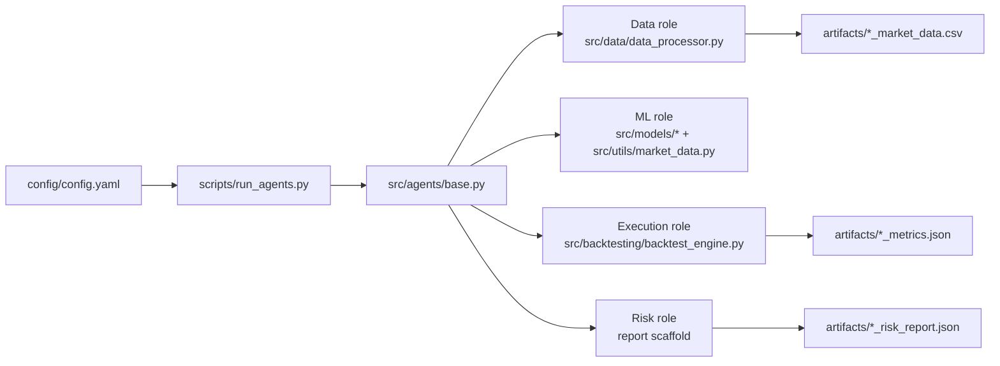

# Project Guide

## Purpose

This guide is the single source of truth for:
- What the project does now
- How to run it
- How to test it
- How data flows through the system
- What can be extended next

It is designed for both human contributors and AI agents.

## Current Capabilities

1. Simulated market data generation and preprocessing
- `src/data/data_processor.py`

2. Signal and feature computation
- `src/utils/market_data.py`

3. Market making models
- `src/models/avellaneda_stoikov.py`
- `src/models/rl_enhanced_model.py`

4. Backtesting
- `src/backtesting/backtest_engine.py`

5. Multi-agent runtime orchestration
- `scripts/run_agents.py`
- `src/agents/base.py`
- `config/config.yaml`

6. Test and integration workflows
- `tests/test_market_data_integration.py`
- `tests/test_integration.sh`
- `scripts/integration_example.py`

7. Real market data snapshot module
- `src/data/real_market_data.py`
- `scripts/fetch_real_market_data.py`

8. Realtime strategy quote loop (server-ready)
- `scripts/run_realtime_strategy.py`
- `docker-compose.server.yml`
- `scripts/deploy_server.sh`

## Runtime Modes

- `backtest`: safe default, simulation-only execution
- `paper`: reserved mode for paper trading paths
- `live`: requires credentials and fails fast if missing

Current policy:
- `PAPER_ONLY=1` is the default and live mode is blocked.
- MVP operation is paper/simulation only until quant and risk gates are satisfied.

Live mode environment requirements:
- `EXCHANGE_API_KEY`
- `EXCHANGE_API_SECRET`

## Architecture



## Data Flow

1. Data role produces market data
- Generates simulated OHLCV + spread + derived features.
- Writes `artifacts/<run_id>_<agent>_market_data.csv`.

2. ML role computes signals and model quotes
- Reads simulated market frame.
- Computes `volatility`, `trend_strength`, `momentum`, `mean_reversion`.
- Produces bid/ask snapshot in runtime output.

3. Execution role runs enhanced backtest
- Uses model + market features and simulates trades.
- Writes `artifacts/<run_id>_<agent>_metrics.json`.

4. Risk role writes baseline risk report
- Writes `artifacts/<run_id>_<agent>_risk_report.json`.

## How To Run

### Recommended: Docker

Preferred interface is Makefile:

```bash
make validate
```

This executes:
- `make build`
- `make run-backtest`
- `make test`
- `make live-guard`

If you need step-by-step:

1. Build image

```bash
make build
```

2. Run backtest mode

```bash
make run-backtest
```

Expected result:
- Exit code `0`
- Log event `runtime_complete` with `failures: 0`
- Files created in `artifacts/`

### Override command and mode

```bash
make run MODE=backtest MAX_WORKERS=4
```

### Fetch real public market data

```bash
make real-data-fetch EXCHANGE=binance SYMBOL=BTC/USDT TIMEFRAME=1m
```

Expected result:
- Snapshot files written under `data/real/`
- Console JSON includes file paths and metadata row counts

### Analyze last-month strategy (public data, no keys)

```bash
make analyze-last-month EXCHANGE=binance SYMBOL=BTC/USDT TIMEFRAME=5m DAYS=30 MAX_COMBINATIONS=12
```

Expected result:
- Last-month klines fetched
- Parameter sweep completed
- Analysis JSON + CSV files written to `artifacts/last_month_analysis/`
- Report includes a `readiness` block (`ready_for_live_keys`) for pre-live gating

### Realtime strategy loop (public data)

```bash
make realtime-paper EXCHANGE=binance SYMBOL=BTC/USDT TIMEFRAME=1m ITERATIONS=20
```

Expected result:
- Real market data snapshots are polled each iteration
- Bid/ask quotes are emitted as JSON lines
- Output JSONL saved under `artifacts/realtime/`

### Server deployment

```bash
make deploy-server SERVER=user@host SERVER_DIR=/opt/marketmakerl
```

Expected result:
- Repository synced to server
- `realtime-strategy` container built and started via `docker-compose.server.yml`

### Live mode (guarded)

Without secrets, expected failure:

```bash
make live-guard
```

Expected error:
- `mode=live requires env vars: EXCHANGE_API_KEY, EXCHANGE_API_SECRET`

With secrets:

```bash
EXCHANGE_API_KEY=your_key EXCHANGE_API_SECRET=your_secret make run-live
```

Note:
- If `PAPER_ONLY=1`, live mode is intentionally blocked even with keys.

## How To Test

### Unit tests

```bash
make test-unit
```

Expected:
- All discovered `tests/test_*.py` suites pass
- Final status `OK`

### Integration workflow

```bash
make test-integration
```

Expected:
- Unit tests pass
- Integration example runs
- Visualization images updated in `visualizations/`

### Quality gates (team contract)

Defined in `agent_ops/team.yaml`:
- `make validate`

Make and Docker-equivalent commands are above.

## What You Can Do Next

1. Connect real exchange execution paths
- Extend `DataProcessor.connect_exchange()` and execution role path.

2. Tune liquidation and inventory policy on real-data windows
- Re-run `make analyze-last-month` by symbol/timeframe and update `max_inventory` defaults accordingly.

3. Add strict metrics schema validation
- Validate `artifacts/*_metrics.json` against a JSON schema.

4. Add CI pipeline
- Run Docker build + test commands on each pull request.

5. Expand risk role
- Move from scaffold report to real risk controls and kill-switch behavior.

6. Implement order execution adapter
- Current realtime service is quote generation only.
- Add private-endpoint order placement and position reconciliation before production trading.

## AI Agent Onboarding

### Stable contracts

- Runtime config contract: `config/config.yaml`
- Runtime entrypoint: `scripts/run_agents.py`
- Runtime role implementations: `src/agents/base.py`
- Shared artifacts path: `artifacts/`
- Team ownership map: `agent_ops/team.yaml`

### Edit boundaries

- Runtime scaffolding: `scripts/`, `config/`, `src/agents/`
- Data/signal: `src/data/`, `src/utils/market_data.py`
- Models: `src/models/`
- Backtest/risk metrics: `src/backtesting/`
- Tests/docs: `tests/`, `README.md`, `docs/`

### Safe defaults

- Prefer `mode=backtest`
- Do not run `mode=live` without explicit user request and credentials

## Troubleshooting

1. Docker daemon permission errors
- Ensure Docker Desktop is running.
- Re-run with `docker compose build` then `docker compose run --rm agents`.

2. Missing dependency errors
- Rebuild image after dependency changes:

```bash
make build
```

3. No artifacts generated
- Check command exit code and logs for `agent_failed` events.
- Validate `config/config.yaml` has at least one agent per required role.

## Related Docs

- `README.md`: quick entrypoint
- `docs/FEATURE_CATALOG.md`: full feature inventory with implementation status
- `docs/IMPLEMENTED_CHANGES.md`: detailed record of implemented changes
- `docs/REAL_DATA_DEVELOPMENT_PLAN.md`: staged migration plan to real data and lightweight trading
- `docs/MVP_EXECUTION_PLAN.md`: milestone ownership and delivery gates
- `docs/STAKEHOLDER_MVP_BRIEF.md`: stakeholder-facing MVP status and demo script
- `docs/MVP_SIGNOFF_CHECKLIST.md`: signoff checklist for launch readiness
- `docs/DEPLOYMENT_GUIDE.md`: remote server deployment and operations
- `docs/completed_enhancements.md`: MVP enhancement summary
- `docs/documentation_acceptance_checklist.md`: doc quality gate
- `Makefile`: canonical command interface for run/test/validate
- `agent_ops/research_alignment.md`: planning assumptions and merge sequencing
